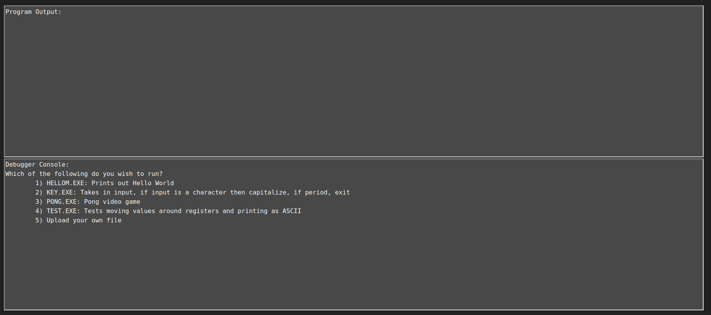
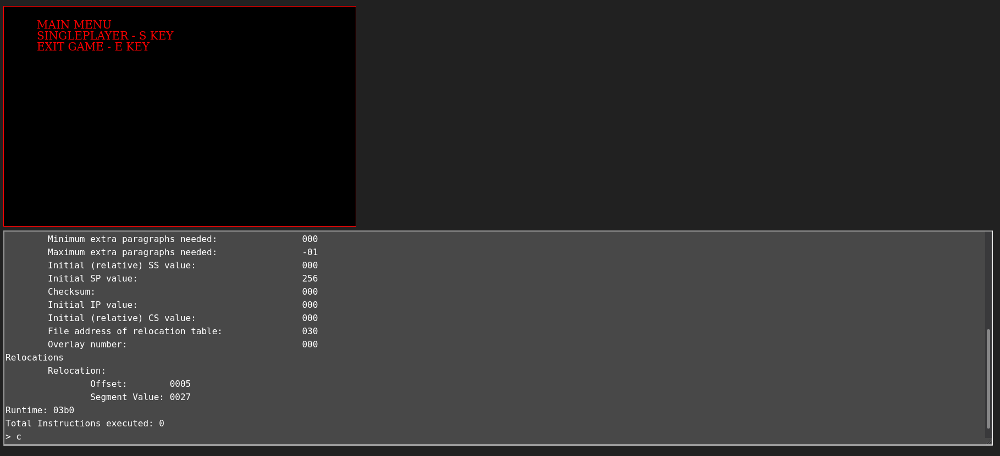
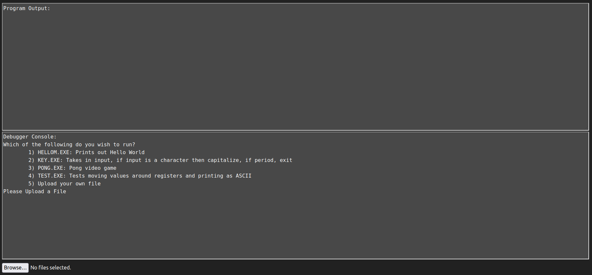

# Introduction

I started this project in order to try and get a better understanding of the MS DOS operating system, this is because I had noticed that a lot of disassemblers and decompilers had issues when it came to MS DOS. The other reason was because I wanted to see if I could play pong on a homemade emulator. The emulator started off as being a linux native project but about halfway through I decided to port it to webassembly so it could be hosted on a static website and accessed from anywhere. Over the course of building the emulator I learned a lot about MS DOS and managed to find an issue with how IDA parses the header to find the start address of the code. 

This blog post is part 1 of 3 in a series where I will discuss how the emulator works and how I ported c++ to webassembly to allow the emulator to run on the web. Part 2 will discuss the optimizations I had to perform due to compilation issues with emscripten and how I had to write a patcher for the emscripten output. And part 3 will go into depth about the DOS internals that I learned about for this project.

You can try out the emulator [here](../../examples/DOS%20Emulator/)

# The Emulator

## The UI



Currently the Emulator has two main windows. The program output window and the Debugger console window. Both of these windows can be resized by dragging the bottom right hand corner of the windows in case you want to see more of the program output or the debugger console. 

Program output will only output what the dos executable outputs while everything going to stdout in the emulator will be sent to the debugger console. The program output window gets cleared everytime a new program gets loaded into the emulator. If a program requires video mode, then the program output window will be replaced with the video mode window:



The video mode window cannot be resized and is set to have a height of 400 pixels and a width of 640 pixels. When another program gets loaded the video mode window will revert back to the program output window.

The debugger console window will act like a terminal for the user to use. At this point there is no tab auto-complete. The terminal detects if the user types anywhere on the webpage by hooking the key up events. On enter the command will be send to the wasm backend and on backspace it will allow the user to delete the last character they typed. The debugger console will mainly be used to interact with the debugger.

The final component of the UI is the file upload button. The upload button is hidden unless the user decides to run an uploaded file rather than one of the four pre installed sample files:



When you upload a file through the button, the emulator will load the file and check if it is an MS DOS file, if it is, then it will start emulating the file.

## Pre-installed Exes

The emulator comes pre-installed with four different example files. These were some test files that I used while writing the emulator and let me test various instructions and interrupts. 

1. HELLOM.exe has Hello World stored in the data section. The assembly then gets the pointer to the string and calls an interrupt to print out the whole string.

2. KEY.exe uses non echoing stdin to read anything you type. If the character is A-Z or ' ' (space) it will be written to stdout, if it is a-z it will be converted to uppercase and then printed out. If the character is a period '.' the program will print out the '.' and exit the program. All other characters will be ignored.

3. PONG.exe is an entire game of pong. This was the final goal of this project since it let me test the video mode as well as quite a few instructions without having to implement every single instruction that can be run. The control for this are O/o for the right paddle going up, L/l for the right paddle going down and W/w for the left paddle going up, and S/s for the left paddle going down. This executable also includes an allocated space for a stack and has several function calls. IDA was unable to correctly find the start of the code segment for this program.

4. TEST.exe moves AAFF into eax and then prints out the hex values. This program lets you use the debugger to see how the registers are set and how different instructions modify them.

## The Debugger

The most important feature of the emulator is the built in debugger. The debugger allows the user to view flags, registers, special registers, and chunks of memory, both in the code segment as well as the data segment. The debugger also lets you set break points, continue to the next instruction, and even lets you step a certain amount of steps before it automatically breaks again. If you ever forget all of the features you can type h or help and see the following:

```
Commands:
	next (n):   Step to next instruction
	status (s): Prints status of registers and flags
	step (st) <#>: Runs for # amount of instructions
	print (p): Prints current address and opcode
	pm <#>: Prints memory at region (begin with 0x to display hex)
	b <#>: Sets breakpoint at address (begin with 0x to display hex)
	c: Continue program execution
	help (h):   Get a list of commands
```

Most of the commands are fairly self explanatory from their descriptions in the above but I am going to go into a bit more detail for each one, feel free to skip this portion.

### next

The next command can be run using `next` or `c` and is fairly simple for my debugger. Unlike other debuggers, which may use next to go the next function or a line of code. The next command for the dos emulator performs the next x86 instruction. After the instruction is executed the debugger waits for the next input.

### status

The status command can be run using `status` or `s` and prints out the registers, special registers, and all of the flags. When run for `TEST.exe` at the start of the program we see:


```
Status:
	Registers:
		AX: 00 00		CX: 00 00		DX: 00 00		BX: 00 00
		SP: 01 00		BP: 00 00		SI: 00 00		DI: 00 00
	Special Registers:
		ES: 00 00		CS: 00 00		SS: 00 07
		DS: 00 00		FS: 00 00		GS: 00 00
	Flags:
		CF: 0		PF: 0		AF: 0		ZF: 0
		SF: 0		IF: 0		DF: 0		OF: 0
```


### step

The step command can be run using `step` or `st` followed by a number and is similar to the next command by letting you let the emulator run several instructions before stopping again. The emulator will run the number of steps you specify as the second parameter.

### print

The print command can be run using `print` or `p` and is used to print out your current address as well as the current opcode. The current address is the offset from the start program.

### print memory

The print memory command can be run using `pm` followed by a value in hex or decimal and is used to print out regions of memory. The value you give will be offset from the start of the program so you can look at data sections as well as executable memory. The command will print out a block of 5 by 16 bytes from memory.

### set breakpoint

The breakpoint command can be run using `b` followed by a value in hex or decimal. The values are offset from the start of the program not from the start of the executable memory (use the value printed from the print command). Breakpoints will only work if they are pointed at the start of an instruction. When the emulator tries running an instruction that starts at the address it will enter debug mode.

### continue program

The continue command can be run using `c` and will exit the emulators debugger mode. If there are no breakpoints set the program will continue till the end of its execution.


# Compiling and Porting C++ to the Web

One of my goals for this project was to find a way to make the emulator easily accessible for everyone since a lot of tools end up getting dependent on operating systems or special libraries once you start adding graphics. After a bit of research I came across this tool called [emscripten](https://emscripten.org/) which let me compile C++ directly to WASM which in turn let me deploy my emulator as a static website which meant anyone with an internet connection could use it.

## Compiling the Code

Emscripten has a lot of options for compiling our C++ to webassembly but I am going to stick to the options we use for compiling the emulator:

```
../emcc -o index.html -s FETCH=1 -s ASYNCIFY -s NO_EXIT_RUNTIME=0 -s INITIAL_MEMORY=1GB -s ALLOW_MEMORY_GROWTH=1 --preload-file examples -fno-rtti -fno-exceptions -O3 ./src/main.cpp ./src/emulator.cpp ./src/bridge.cpp
```

`-o index.html` 

The `-o` flag specifies our output after we have run the compiler. Since we specify .html, emscripten generates three files: index.html, index.js, and index.wasm. We will want to replace the index.html with the one in the root directory of our project since that is the frontend. The index.js allows us to call functions that are then run in the index.wasm.

`-s FETCH=1`

Setting FETCH to 1 turns on emscriptens built in [Fetch API](https://emscripten.org/docs/api_reference/fetch.html) which allows the program to transfer files via XHR (GET, PUT, POST). The API also allows us to persist data in the browsers IndexedDB storage. This is very important as it allows us to send our debugger instructions and the uploaded files to the backend.

`-s ASYNCIFY`

This flag allows us to use [asyncify functions](https://emscripten.org/docs/porting/asyncify.html) which lets our C++ interact asynchronously with our javascript frontend. This makes that if the backend is waiting on something from the frontend it doesn't freeze up the whole browser tab.

`-s NO_EXIT_RUNTIME=0`

This flag allows us to print in the backend code and have it show up in the frontend without needing to flush the stream or include a new line. This is more of a quality of life addition rather than one that is needed.

`-s INITIAL_MEMORY=1GB` and `-s ALLOW_MEMORY_GROWTH=1`

As most of you can guess, the `ALLOW_MEMORY_GROWTH` allows for the memory of the emulator to grow dynamically. However, this leads to the emulator being incredibly slow at the start so I added the `INITIAL_MEMORY` flag and set it to 1GB. This is a bit of overkill but better safe than sorry, when I was testing the emulator with pong I usually ended up using around 500MB.

`--preload-file examples`

This flag is one of my favorites that emscripten provides. With this flag we can load files into a "filesystem" that the backend program has access to. This means that in order to open one of the example files I can just pretend like I am on a normal filesystem and use `fopen`.

`-fno-rtti -fno-exceptions -O3`

These flags are used to optimize the code and shrink it down. fno-rtti gets rid of rtti while fno-exceptions removes exceptions. O3 is the highest level of optimization available in emscripten.

## Javascript Interface

Now that we have talked about how to build the project, lets talk about how to actually make the backend speak to the frontend. As I had discussed in the last section, we enabled the fetch API and as a result were able to use XHR to have the frontend and backend interact. 

### XHR

Most of the code that involved sending commands or data back to the C++ backend was in the `c_interface.js` file. In that file we overwrite the XmlHttpRequest on window with a function that contains all of the commands we want:

```js
var re = /^___emulator::/;
// XHR proxy that handle methods from fetch in C
window.XMLHttpRequest = (function (xhr) {
    return function () {
        var url;
        var props = {
            readyState: 4,
            status: 200
        };
        var enc = new TextEncoder("utf-8");
        return new Proxy(new xhr(), {
            get: function (target, name) {
                if (url && ['response', 'responseText', 'status', 'readyState'].indexOf(name) != -1) {
                    if (name == 'response') {
                        var response = enc.encode(props.responseText);
                        return response;
                    }
                    return props[name];
                } else if (name == 'open') {
                    return function (method, open_url) {
                        if (open_url.match(re)) {
                            url = open_url;
                        } else {
                            return target[name].apply(target, arguments);
                        }
                    };
                } else if (name == 'send') {
                    return function (data) {
                        if (url) {
                            var payload = url.split('::');

							// Put commands here
                            if (payload[1] == 'read') {
                                $("#output").val($("#output").val() + "> ");
                                read(
                                    function (text) {
                                        props.responseText = text + '\0';
                                        target.onload();
                                    }
                                );
                            }
							
							...

							// End of commands

                        } else {
                            return target[name].apply(target, arguments);
                        }
                    };
                }
                return target[name];
            },
            set: function (target, name, value) {
                target[name] = value;
            }
        });
    };
})(window.XMLHttpRequest);
```

This code means that if the frontend receives a GET request with a url of `___emulator::read` we would go into that if statement. To return the text to the backend we will then call the function we create and pass to the read function:

```js
function (text) {
    props.responseText = text + '\0';
    target.onload();
}
```

### Pseudo Terminal

The emulator and debugger features a pseudo-terminal where the user can both type and delete commands. The terminal is mainly used for debugging and is implemented by creating keyboard hooks. If a character is detected it adds it to the text in the "terminal" and when a backspace is detected it deletes the latest character. This allows for the user to have a more fluid feel when interacting with the program.

# Part 2:

In Part 2 of this series I will discuss:

- Performance issues in emscripten 
    - An analysis of how emscripten behaves with different browsers
    - How to profile JS and webassembly using emscripten
- Patching emscripten output to fix performance issues
- Overview of Memory Leaks with built in emscripten functions