# Introduction

This blog post will use the singleplayer game, Journey to the Savage Planet, in order to teach others about winapi, memory manipulation, function hooking, and other similar techniques. This post does not encourage or condone game hacking for any multiplayer games as well as distribution of game hacks, the reason I use a game for this post is because it is much easier to see your changes and it is much more fun than reversing some other program.

Journey to the Savage Planet is built using the unreal game engine, however this post will not go into detail about how to bypass or reverse the unreal game engine, instead it will focus on techniques that can be used for any windows applications. The reason the game was chosen was because it was provided for free to people with amazon prime, it does not have its symbols stripped so we can focus on techniques, and finally because it has an open world which means we can make some pretty cool hacks for it.

# Poking at the game with cheat engine

Once I check out the game a bit and figure out what things I might want to edit I then start poking at the game with cheat engine. Since the game is built by unreal engine I most likely will not have much luck finding "good" pointers just by using cheat engine because of how the engine works. But that won't stop us from trying.

When approaching a new game with cheat engine I always start off by trying to find some value that is easily editable (preferably decrementing and incrementing) and one where we know the actual value so that we don't have to do any guessing. Because of this I chose to start by messing with the ammo value.

## Find the ammo pointer

Ammo values are often not just a 4 byte int so after attaching cheat engine to my process I started a new search with value type all and the original value being 10:

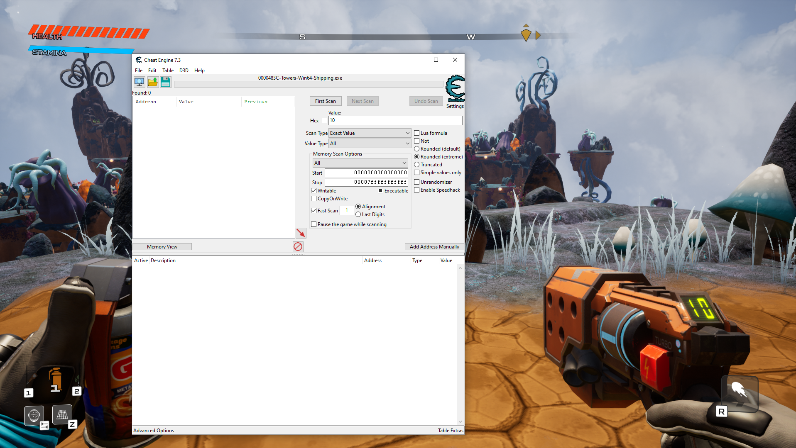

After about 5 searches where I would shoot and then search for the new value I was able to narrow the found addresses down to 7:

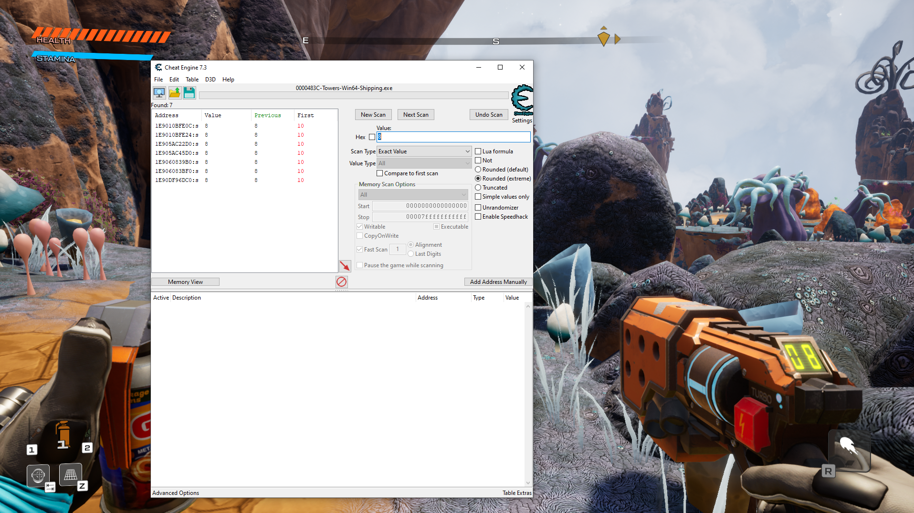

I then edited the values of each of these addresses until I found the one that changed the ammo. For this I had to edit the value and then shoot since the UI was updated after you shoot the gun. To test, I froze the value at the address and from there I was able to get unlimited ammo:


At this point I can do two different approaches, find the pointer, or find what modifies the value. Since this is a unreal game we don't really want to find the pointer since it won't be of much use for us but we are going to go ahead and do that first. The pointer itself may not be the most helpful but it will make that we do not have to find the address each time we relaunch the game.

The first thing we want to do when trying to find the pointer is to generate a pointer map. We do this by right clicking the address, clicking on Generate pointermap, and then saving the file somewhere on your system.


With most large games you will want to generate multiple pointer maps before you start pointer scanning so that the program runs faster and gets better results. So we are going to write down the address of the current ammo value, restart the game, find the new ammo address and generate another pointer map.

After generating 3 pointer maps I got the following addresses:

```
ammo1.scandata => 1E9010BFE0C
ammo2.scandata => 21E878218CC
```

Once we have generated the last pointer map we can now do a pointer scan using the pointer map. The pointer scan is on the same right click menu as generating the pointer map. Once the menu pops up we will want to click on "Use saved pointermap" and then select the map we just made. I then also clicked compare results with other saved pointermaps and filled in the addresses from above. I am going to use max level of 7 (not the most recommended for everyone since it is compute heavy though it isn't too bad with our pointer maps). 

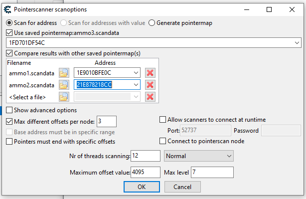

After being run you can see that there are still a ton of pointer paths, but since we only care about finding one so we don't need to find the address again we can just add a bunch of the values to cheat engine, restart, and see which ones still point to the correct value:

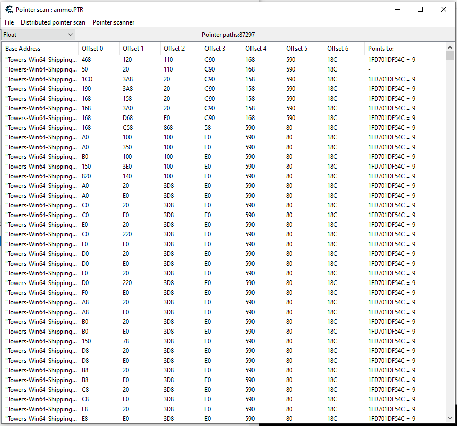

After restarting the game I can see that several of the pointers I found were successful, so now we don't have to search again next time we start the game.

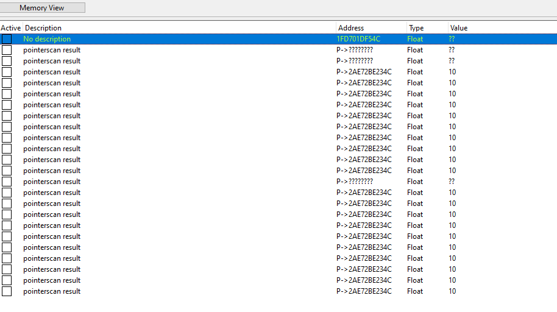

## Finding the ammo assembly

Now that we found the ammo pointer we can actually do the correct approach for natively approaching the unreal game engine. We are going to right click on one of the pointers we found, press fine what writes to this address, click yes to attach debugger, and then click find what writes the address pointed at by this pointer.

Once the debugger was attached I then shot my gun 10 times and let it reload, at this point I saw the following:

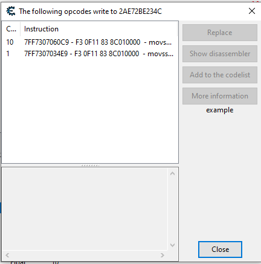

From this I could guess that the first instruction was used to reduce the ammo value after shooting and the second instruction was used to increase the ammo value on reload.

I then clicked on the first instruction and clicked on "show disassembler":

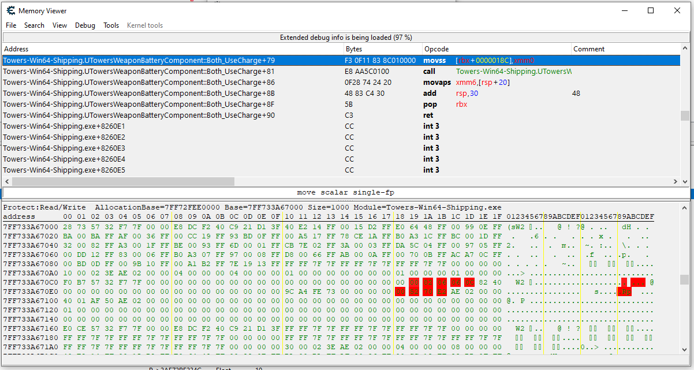

NOPing those bytes out then let me shoot an unlimited amount of times without my ammo value decreasing, restoring the bytes then enabled the loss of ammo once again.

## Finding the address of the opcodes

Ok, so now we have found the pointer as well as the opcodes that let us toggle ammo usage on and off, however, we don't always want to have to open cheat engine in order to patch the memory so we need to find the offset from the executable.

From the last screenshot where we had the opcodes we can see that the opcodes are offset 0x79 from the function UTowersWeaponBatteryComponent::Both_UseCharge. Our first step here is to click on View, and then Enumerate DLL's and symbols:

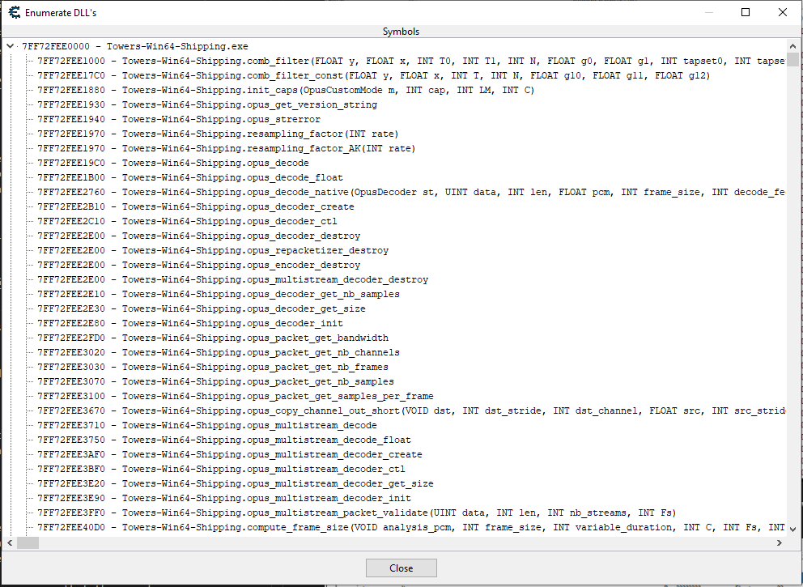

From this we can see that the base address of the executable is 0x7FF72FEE0000 and our function (found by ctrl + f) is at 0x7FF730706050. The offset to the start of the function is 0x826050 and then to get the offset to the code we add the 0x79 to get 0x8260C9.

# Programatically changing memory

## Setting up the DLL

We will now create a program that can be injected into the game in order to modify the opcodes that we found. For this we will use visual studio and C++.

After opening Visual Studio I then selected the Dynamic-Link Library (DLL) template and named my project JourneyToSavagePlanetHack. This then creates a `dllmain.cpp` with the following code:

```c++
// dllmain.cpp : Defines the entry point for the DLL application.
#include "pch.h"

BOOL APIENTRY DllMain( HMODULE hModule,
                       DWORD  ul_reason_for_call,
                       LPVOID lpReserved
                     )
{
    switch (ul_reason_for_call)
    {
    case DLL_PROCESS_ATTACH:
    case DLL_THREAD_ATTACH:
    case DLL_THREAD_DETACH:
    case DLL_PROCESS_DETACH:
        break;
    }
    return TRUE;
}
```

Since we want our code to execute when our dll gets attached to a process we are going to create a function and call it from the `DLL_PROCESS_ATTACH` case making our file look like:

```c++
// dllmain.cpp : Defines the entry point for the DLL application.
#include "pch.h"

DWORD WINAPI MainThread(LPVOID param)
{

	FreeLibraryAndExitThread((HMODULE)param, 0);
	return 0;
}

BOOL APIENTRY DllMain( HMODULE hModule,
                       DWORD  ul_reason_for_call,
                       LPVOID lpReserved
                     )
{
    switch (ul_reason_for_call)
    {
    case DLL_PROCESS_ATTACH:
        CreateThread(0, 0, MainThread, hModule, 0, 0);
    case DLL_THREAD_ATTACH:
    case DLL_THREAD_DETACH:
    case DLL_PROCESS_DETACH:
        break;
    }
    return TRUE;
}
```

We now have a main thread that gets created when we attach it to the process and then it exits it frees the thread when we are done with our code. 

Since we are going to be making a lot of mistakes and will need to do a good amount of debugging we are going to allocate a console. This lets us print information during runtime and lets us debug a bit:

```c++
// dllmain.cpp : Defines the entry point for the DLL application.
#include "pch.h"
#include "../CPPToolLib/CPP Tools/stdafx/stdafx.h"

DWORD WINAPI MainThread(LPVOID param)
{
    // Allocate Console
    AllocConsole();
    FILE* f;
    freopen_s(&f, "CONOUT$", "w", stdout);

    // Free console
    fclose(f);
    FreeConsole();

	FreeLibraryAndExitThread((HMODULE)param, 0);
	return 0;
}

BOOL APIENTRY DllMain( HMODULE hModule,
                       DWORD  ul_reason_for_call,
                       LPVOID lpReserved
                     )
{
    switch (ul_reason_for_call)
    {
    case DLL_PROCESS_ATTACH:
        CreateThread(0, 0, MainThread, hModule, 0, 0);
    case DLL_THREAD_ATTACH:
    case DLL_THREAD_DETACH:
    case DLL_PROCESS_DETACH:
        break;
    }
    return TRUE;
}
```

Since there we several components we would need to include for this to work I cloned my [CPPToolLib repository](https://github.com/Kasimir123/CPPToolLib) and I included stdafx.h into this project. stdafx is simply a collection of includes that are used throughout many of my projects.

We now also want to set up a loop in the main thread that lets us exit based on user import but otherwise keeps the dll injected:

```c++
DWORD WINAPI MainThread(LPVOID param)
{
    // Allocate Console
    AllocConsole();
    FILE* f;
    freopen_s(&f, "CONOUT$", "w", stdout);

    // Main logic loop
    while (true)
    {
        if (GetAsyncKeyState(VK_SHIFT) && GetAsyncKeyState(VK_ESCAPE)) { break; }
        Sleep(50);
    }

    // Free console
    fclose(f);
    FreeConsole();

	FreeLibraryAndExitThread((HMODULE)param, 0);
	return 0;
}
```

Now that we have the code done, lets build the DLL. In order to build simply right click on the project and press build.

## Injecting the DLL

Now that we have a DLL we need to figure out how to inject the DLL into our process. For this we will use the [DLL Injector](https://github.com/Kasimir123/DLL-Injector) I built. I will write another blog post about the specifics of how the injector functions but for now lets just focus on using the program. You can either clone and build the injector yourself or you can simply download the release build. Since the game is 64 bit we will need to use the 64 bit injector as well.

When launching the injector you will first need to provide the path to the DLL and then after that you can just type which process to inject the DLL into:


As you can see, we were able to spawn a new window and then close it without the application crashing.

## Modifying program memory

Now that we have a means of injecting our code into the game it is time to actually start modifying that code. The first step of this is finding the base address for our executable. So lets take a look at the code for that:

```c++
DWORD WINAPI MainThread(LPVOID param)
{
    ...

    freopen_s(&f, "CONOUT$", "w", stdout);

    // Get Module Info
    MODULEINFO mInfo;
	GetModuleInformation(GetCurrentProcess(), GetModuleHandle(L"Towers-Win64-Shipping.exe"), &mInfo, sizeof(MODULEINFO));

    std::cout << std::hex << mInfo.lpBaseOfDll << std::endl;

    // Main logic loop
    while (true)
    {
        if (GetAsyncKeyState(VK_SHIFT) && GetAsyncKeyState(VK_ESCAPE)) { break; }
        Sleep(50);
    }

    ...
```

[GetModuleInformation](https://docs.microsoft.com/en-us/windows/win32/api/psapi/nf-psapi-getmoduleinformation) is a function provided by winapi that lets us get information about some module given a handle to the module, and a handle to the process. From here we can print out the base of the module to the console we opened up earlier.

Building the dll and injecting it we can then double check our value with cheat engine to make sure we got the correct value:

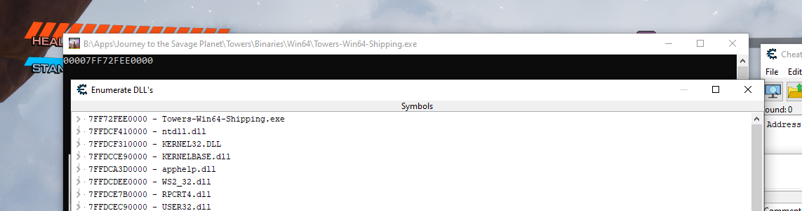

Now that we have the base address we simply need to offset to the opcodes that we want to change and change them. We can do that with:

```c++
    ...

#include "../CPPToolLib/CPP Tools/mem/mem.h"

    ...

    // Get Module Info
	MODULEINFO mInfo;
	GetModuleInformation(GetCurrentProcess(), GetModuleHandle(L"Towers-Win64-Shipping.exe"), &mInfo, sizeof(MODULEINFO));

	bool unlimited_shots = false;

	// Main logic loop
	while (true)
	{
		if (GetAsyncKeyState(VK_SHIFT) && GetAsyncKeyState(VK_ESCAPE)) { break; }

		if (GetAsyncKeyState(VK_NUMPAD0) & 1)
		{
			if (unlimited_shots)
			{
				mem::Patch((BYTE*)((uintptr_t)mInfo.lpBaseOfDll + 0x8260c9), (BYTE*)"\xF3\x0F\x11\x83\x8C\x01\x00\x00", 8);
				std::cout << "Unlimited shots disabled" << std::endl;
			}

			else
			{
				mem::Nop((BYTE*)((uintptr_t)mInfo.lpBaseOfDll + 0x8260c9), 8);
				std::cout << "Unlimited shots enabled" << std::endl;
			}
			unlimited_shots = !unlimited_shots;
		}

		Sleep(50);
	}

    ...
```

In the code snippet above we do quite a few things so lets break it apart. The first thing that I did was define a boolean named `unlimited_shots`, this is going to be what we reference when we do our keyboard input to check whether or not the feature was currently active or not.

The next thing we do is check if 0 is pressed on the numpad, we & the value with 1 so that it doesn't get spammed when you press it one time. If we detect the press we then check whether or not the unlimited shots was already enabled or not.

If `unlimited_shots` is set to false, meaning that the feature currently is not enabled, then we will replace all 8 bytes with 0x90 which is a NOP, otherwise known as no op. We then print out that we enabled to feature.

If `unlimited_shots` is set to true we then write the original bytes back into memory, after which we print out that the feature was disabled.

We are patching the binary using functions from the CPPToolLib repository which we included when we added the code. After we patch the memory we then set the bool to the opposite of what it just was.

Now that we have the new code in the program lets give it a try by building and injecting the code!


As you can see we can both enable and disable the usage of ammo with just a button click and without the game crashing.

# Hooking functions

## Browsing function symbols

Luckily this game did not strip any symbols during compilation time, this makes it great as a learning example since we don't have to worry about doing lots of reverse engineering and can instead focus on exploiting our findings. 

At this point I loaded the program into a decompiler and after it had been analyzed I looked through the symbols to see if there was anything that looked interesting. After a bit of looking around a bit I found the following function `ATowersPlayerPawn::HasEnoughFuelToUseJetpackJumpJets`:

```c
bool __fastcall ATowersPlayerPawn::HasEnoughFuelToUseJetpackJumpJets(ATowersPlayerPawn *this)
{
  return *(float *)&this->DesignTweaks[4].InternalIndex <= this->JetpackFuelAmount;
}
```

Based on the name and the decompilation we can assume that this function is called whenever we try to do a double jump and use our jetpack. So our first step here is to try and hook the function and printing out some value/message if the function is hooked.

## Setting up function hook

In order to perform a function hook in x64 we need a few bits of information first:

- The address of where to hook
- Function information
    - [Calling convention](https://docs.microsoft.com/en-us/cpp/cpp/argument-passing-and-naming-conventions?view=msvc-170)
    - Return type
    - Parameters
- How many opcodes we need to hook to safely perform the hook

I had rebased the binary to 0x0 when I first loaded the file into the decompiler, because of this I could see that the address we want to start our hook from is at an offset of 0x8778C0 from the base of the dll. 

The calling convention is a thiscall, we can see this by looking at what happens when the function is called:

```
mov     rcx, [rdi+7E8h] ; this
movzx   ebx, al
call    ?HasEnoughFuelToUseJetpackJumpJets@ATowersPlayerPawn@@IEBA_NXZ
```

We can see that this is moved into rcx before the function is called.

From the decompilation we can see that the return type is a boolean and the function takes one parameter which is a pointer to an object called ATowersPlayerPawn. 

Now lets take a look at the actually assembly for the function that we want to hook:

```
48 8B 81 00 08 00 00                          mov     rax, [rcx+800h]
F3 0F 10 80 AC 05 00 00                       movss   xmm0, dword ptr [rax+5ACh]
0F 2F 81 F4 11 00 00                          comiss  xmm0, dword ptr [rcx+11F4h]
0F 96 C0                                      setbe   al
C3                                            retn
```

The way that we are going to perform our hook is by allocating memory for our function and then overwriting the opcodes in the original function to jump to our code, then at the end of our code we return back to whatever we had just hooked. For 32 bit a jump needs a minimum of 5 bytes while for 64 bit we need a minimum of 14 bytes.

If we were to just take the first 14 bytes of this function we would have an issue though since when the code returns it would then try to execute that leftover 00 from the second instruction. Because of this we always need to make sure that we hook bytes until the end of an instruction, in this case that would be the first 15 bytes.

## Writing the function hook

Now that we have gathered all the information we need, we can start writing the hook. Luckily we have a class in the CPPToolLib repo to help us do just that. In order to use the class we need to make our own typedef of the function and we need to make the function that we want to redirect to.

So lets start by writing the code:

```c++
typedef BOOL(__thiscall* tCanJump)(void*);
```

The first bit of code that we write is writing the typedef for the function. This simply makes that we can reference it later. For the function we found we needed to return a `BOOL`, we have the calling convention, and we have the parameter. We use a void pointer here since we don't have the class that the program uses. 

```c++
tCanJump canJumpGateway;
```

We then use the typedef we made to create a "gateway", our hook class uses this as a reference back to the original code, this is in case we want to call the original function and just wanted to hook the code to change a parameter or something similar.

```c++
BOOL __fastcall hCanJump(BYTE* _this, void* _ECX)
{
	std::cout << "Can jump hook" << std::endl;
	return canJumpGateway(_this);
}
```

We then make our hooked function. Some of you may have noticed that we use `__fastcall` rather than `__thiscall` and that we have an extra parameter in the function. We want to use `__fastcall` since sometimes `__thiscall` can cause issues when we hook, and as a result we will need to add the extra parameter in order to handle the switch in calling conventions. _this is also typed as a BYTE* instead of a void* since we will not be able to access it the way we want (as discussed in the Messing with objects via offsets section) if it is a void *. We then print out that we are in the hook and then return the value from the original function.

```c++
    ...

    // Create can jump hook
    Hook canJump((BYTE*)((uintptr_t)mInfo.lpBaseOfDll + 0x8778C0), (BYTE*)hCanJump, (BYTE*)&canJumpGateway, 15);

	canJump.Enable();

	// Main logic loop
	while (true)
	{
		if (GetAsyncKeyState(VK_SHIFT) && GetAsyncKeyState(VK_ESCAPE)) { break; }

		if (GetAsyncKeyState(VK_NUMPAD0) & 1)
		{
			if (unlimited_shots)
			{
				mem::Patch((BYTE*)((uintptr_t)mInfo.lpBaseOfDll + 0x8260c9), (BYTE*)"\xF3\x0F\x11\x83\x8C\x01\x00\x00", 8);
				std::cout << "Unlimited shots disabled" << std::endl;
			}

			else
			{
				mem::Nop((BYTE*)((uintptr_t)mInfo.lpBaseOfDll + 0x8260c9), 8);
				std::cout << "Unlimited shots enabled" << std::endl;
			}
			unlimited_shots = !unlimited_shots;
		}

		Sleep(50);
	}

	canJump.Disable();

	if (unlimited_shots)
		mem::Patch((BYTE*)((uintptr_t)mInfo.lpBaseOfDll + 0x8260c9), (BYTE*)"\xF3\x0F\x11\x83\x8C\x01\x00\x00", 8);

    ...
```

We then initialize the Hook class with the start address for the function, the hooked function, the pointer to the gateway we made, and the length we want to hook. Since this is 64 bit we then want to use enable() to hook the function and disable() to unhook it. We want to make sure to unhook the function when closing the dll so that the game doesn't crash when our dll, and our hooked function, are no longer there. We also patch the original bytes back in if they were nop'ed when we exited.

Now that we have the code written we can build and inject once more.


As you can see from the gif, everytime we double jump the text gets printed out but we only get the double jump one time since we are calling the original function. This means that our hook worked, so now we can edit the function to return true after we click a button. We have two different approaches for this, the first is to make a global bool that we toggle and the hooked function checks against, the other option is to enable and disable the hook based on input. For the sake of keeping the code clean I am going to go with the global boolean this time. After doing these edits our code now looks like:

<details>
<summary>Current Code (click to expand)</summary>

```c++
// dllmain.cpp : Defines the entry point for the DLL application.
#include "pch.h"
#include "../CPPToolLib/CPP Tools/stdafx/stdafx.h"
#include "../CPPToolLib/CPP Tools/hook/hook.h"
#include "../CPPToolLib/CPP Tools/mem/mem.h"

// Function typedef
typedef BOOL(__thiscall* tCanJump)(void*);

// Function gateways
tCanJump canJumpGateway;

// Constants
bool unlimited_shots = false, unlimited_jumps = false;


// Hooked can jump function
BOOL __fastcall hCanJump(BYTE* _this, void* _ECX)
{
	if (unlimited_jumps)
	{
		std::cout << "Jump enabled" << std::endl;
		return true;
	}

	std::cout << "Jump disabled" << std::endl;
	return canJumpGateway(_this);
}

DWORD WINAPI MainThread(LPVOID param)
{
	// Allocate Console
	AllocConsole();
	FILE* f;
	freopen_s(&f, "CONOUT$", "w", stdout);

	// Get Module Info
	MODULEINFO mInfo;
	GetModuleInformation(GetCurrentProcess(), GetModuleHandle(L"Towers-Win64-Shipping.exe"), &mInfo, sizeof(MODULEINFO));

	// Create can jump hook
	Hook canJump((BYTE*)((uintptr_t)mInfo.lpBaseOfDll + 0x8778C0), (BYTE*)hCanJump, (BYTE*)&canJumpGateway, 15);

	// Enable hook
	canJump.Enable();

	// Main logic loop
	while (true)
	{
		if (GetAsyncKeyState(VK_SHIFT) && GetAsyncKeyState(VK_ESCAPE)) { break; }

		// Unlimited shots
		if (GetAsyncKeyState(VK_NUMPAD0) & 1)
		{
			if (unlimited_shots)
			{
				mem::Patch((BYTE*)((uintptr_t)mInfo.lpBaseOfDll + 0x8260c9), (BYTE*)"\xF3\x0F\x11\x83\x8C\x01\x00\x00", 8);
				std::cout << "Unlimited shots disabled" << std::endl;
			}

			else
			{
				mem::Nop((BYTE*)((uintptr_t)mInfo.lpBaseOfDll + 0x8260c9), 8);
				std::cout << "Unlimited shots enabled" << std::endl;
			}
			unlimited_shots = !unlimited_shots;
		}
		// Unlimited jumps
		else if (GetAsyncKeyState(VK_NUMPAD1) & 1)
			unlimited_jumps = !unlimited_jumps;

		Sleep(50);
	}

	// Disable hook
	canJump.Disable();

	// Fix memory
	if (unlimited_shots)
		mem::Patch((BYTE*)((uintptr_t)mInfo.lpBaseOfDll + 0x8260c9), (BYTE*)"\xF3\x0F\x11\x83\x8C\x01\x00\x00", 8);

	// Free console
	fclose(f);
	FreeConsole();

	// Free thread
	FreeLibraryAndExitThread((HMODULE)param, 0);
	return 0;
}

BOOL APIENTRY DllMain(HMODULE hModule,
	DWORD  ul_reason_for_call,
	LPVOID lpReserved
)
{
	switch (ul_reason_for_call)
	{
	case DLL_PROCESS_ATTACH:
		CreateThread(0, 0, MainThread, hModule, 0, 0);
	case DLL_THREAD_ATTACH:
	case DLL_THREAD_DETACH:
	case DLL_PROCESS_DETACH:
		break;
	}
	return TRUE;
}
```
</details>

After building and running the program we can see that we can toggle unlimited jumps to either be normal or to give us unlimited jumps:


## Messing with objects via offsets

Sometimes we don't want to just send a different parameter to a hooked function and sometimes you are forced to go through a certain function, luckily, this hook we just made gives us the perfect chance to practice modifying values on a class within the code.

```c++
  return *(float *)&this->DesignTweaks[4].InternalIndex <= this->JetpackFuelAmount;
```

So rather than simply returning true, lets try modifying the JetpackFuelAmount. Using the decompiler we can see that JetpackFuelAmount has an offset of 0x11F4 from the object and that the type is a float. So lets edit our hooked function to print out the value when our fuel is full and the value when our fuel is empty:

```c++
// Hooked can jump function
BOOL __fastcall hCanJump(BYTE* _this, void* _ECX)
{

	std::cout << *(float*)(_this + 0x11F4) << std::endl;

	if (unlimited_jumps)
	{
		std::cout << "Jump enabled" << std::endl;
		return true;
	}

	std::cout << "Jump disabled" << std::endl;
	return canJumpGateway(_this);
}
```

When run we can see that the value when full is 1 and the value when empty is 0.

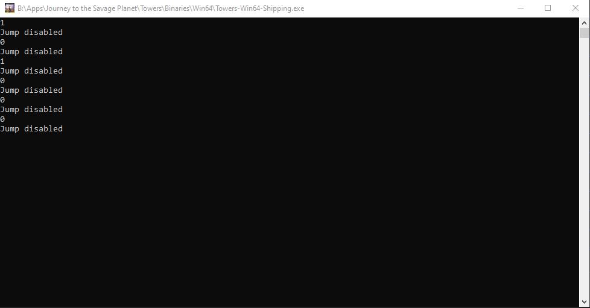

So lets try editing the function again in order to set the value of the fuel before we pass it to the gateway:

```c++
// Hooked can jump function
BOOL __fastcall hCanJump(BYTE* _this, void* _ECX)
{

	if (unlimited_jumps)
		*(float*)(_this + 0x11F4) = 1.0;

	return canJumpGateway(_this);
}
```

We can use this technique to change a lot of things within a process. We can call other functions from our hooked function and pass our object or objects on that object, we can call functions from that object, we can really do almost everything the game can do with that object. 


# Creating a GUI for the hack

## Why do we want a GUI

If we are just toggling different hacks, we really don't need a GUI. However, as our hack grows we are going to start running out of numpad numbers that we can use for toggling. Another scenario where we will need a GUI is if we want to change a value at runtime. So lets take a look at such a situation.

After browsing through the symbols a bit more I found a function called `UTowersCharacterMovement::GetMaxSpeed` and is used to help the game determine the players max movement speed. 

```c++
float __fastcall UTowersCharacterMovement::GetMaxSpeed(UTowersCharacterMovement *this)
{
  v2 = UCharacterMovementComponent::GetMaxSpeed(this);
  v3 = this->PlayerPawn;
  v4 = v2;
  if ( v3 )
  {
    v5 = ATowersCreaturePawn::GetDesignTweaksCreature(v3);
    v6 = (float *)v5;
    if ( v5 )
    {
      v7 = this->PlayerPawn;
      v8 = v7->InWater;
      if ( v7->PlayerContextRepData.JetpackDodgeState == ActiveWithMontage )
      {
        v9 = v5->JetpackDodgingMaxSpeed;
      }
      else
      {
        v10 = v7->PlayerContextRepData.JetpackHoveringState;
        if ( v10 == ActiveWithMontageEnded )
        {
          v11 = ATowersPlayerPawn::IsStatusEffectActive(v7, Enable);
          v7 = this->PlayerPawn;
          if ( v11 )
          {
            v9 = v6[720];
          }
          else
          {
            if ( !v7->InStickyPatch )
            {
              if ( v7->PlayerContextRepData.bIsCrouching )
              {
                if ( !v7->PlayerContextRepData.bIsSliding )
                {
                  v9 = v6[330];
                  return v9 * ATowersPlayerPawn::GetMaxSpeedMultiplier(v7);
                }
              }
              else
              {
                if ( !v7->PlayerContextRepData.bIsSprinting )
                {
                  if ( (*((_BYTE *)&v7->ATowersCharacterBase + 2128) & 1) != 0 )
                  {
                    v9 = v6[326];
                  }
                  else if ( v8 )
                  {
                    v9 = v6[271];
                  }
                  else
                  {
                    v9 = v6[270];
                  }
                  return v9 * ATowersPlayerPawn::GetMaxSpeedMultiplier(v7);
                }
                if ( v8 )
                {
                  v9 = v6[295];
                  return v9 * ATowersPlayerPawn::GetMaxSpeedMultiplier(v7);
                }
              }
              v9 = v6[294];
              return v9 * ATowersPlayerPawn::GetMaxSpeedMultiplier(v7);
            }
            v9 = v6[272];
          }
        }
        else
        {
          v9 = v6[24 * (unsigned __int8)v10 + 494];
        }
      }
      return v9 * ATowersPlayerPawn::GetMaxSpeedMultiplier(v7);
    }
  }
  return v4;
}
```

Looking at the decompiled code from GetMaxSpeed we can see that this function returns different values based on if we are crouched or in a sticky patch, etc. 

At this point I decided that I wanted to create a hook where I could multiply whatever value was spat out by this function, and since I didn't want the multiplier to always be set to some extreme value I need a way that I can change it during the game.

## Creating a window from within a DLL

In order to create a window from within a DLL we will need to use the [CreateWindow](https://docs.microsoft.com/en-us/windows/win32/api/winuser/nf-winuser-createwindowexa) function. 

To get started we are going to replace the main loop in the code we had above with the following:

```c++
    ...

    // Main Loop
	// Create window menu
	HMENU hMenu = CreateDLLWindowMenu();

	// Register window
	RegisterDLLWindowClass((wchar_t*)L"JourneyHack");

	// Create Window
	hwnd = CreateWindowEx(0, L"JourneyHack", L"Journey To Savage Planet Trainer", WS_EX_PALETTEWINDOW, CW_USEDEFAULT, CW_USEDEFAULT, 800, 600, NULL, hMenu, hMod, NULL);

	// Show window
	ShowWindow(hwnd, SW_SHOWNORMAL);

	// Loop and translate messages till end
	MSG messages;
	while (GetMessage(&messages, NULL, 0, 0))
	{
		TranslateMessage(&messages);
		DispatchMessage(&messages);
	}

    ...
```

The first thing we do is create a window menu and then we register our window class. We then pass these values into CreateWindow based on what the docs on MSDN say. The important things are that the class name matches the name from the class we registered beforehand and that the 800 and 600 are the size of the window.

CreateDLLWindowMenu and RegisterDLLWindowClass are both functions that we also have to write:

```c++
#define MYMENU_EXIT         (WM_APP + 101)
#define MYMENU_MESSAGEBOX   (WM_APP + 102) 

HINSTANCE hMod;  
HWND hwnd;

//WndProc for the new window
LRESULT CALLBACK DLLWindowProc(HWND, UINT, WPARAM, LPARAM);

//Register our windows Class
BOOL RegisterDLLWindowClass(wchar_t szClassName[])
{
	WNDCLASSEX wc;
	wc.hInstance = hMod;
	wc.lpszClassName = (LPCWSTR)szClassName;
	wc.lpfnWndProc = DLLWindowProc;
	wc.style = CS_DBLCLKS;
	wc.cbSize = sizeof(WNDCLASSEX);
	wc.hIcon = LoadIcon(NULL, IDI_APPLICATION);
	wc.hIconSm = LoadIcon(NULL, IDI_APPLICATION);
	wc.hCursor = LoadCursor(NULL, IDC_ARROW);
	wc.lpszMenuName = NULL;
	wc.cbClsExtra = 0;
	wc.cbWndExtra = 0;
	wc.hbrBackground = (HBRUSH)COLOR_BACKGROUND;
	if (!RegisterClassEx(&wc))
		return 0;
}
//Creating our windows Menu
HMENU CreateDLLWindowMenu()
{
	HMENU hMenu;
	hMenu = CreateMenu();
	HMENU hMenuPopup;
	if (hMenu == NULL)
		return FALSE;
	hMenuPopup = CreatePopupMenu();
	AppendMenu(hMenuPopup, MF_STRING, MYMENU_EXIT, TEXT("Exit"));
	AppendMenu(hMenu, MF_POPUP, (UINT_PTR)hMenuPopup, TEXT("File"));

	return hMenu;
}
```

RegisterDLLWindowClass simply just creates the windows class object and populates the fields. CreateDLLWindowMenu is used to make the menu on the top of the window, here we make a menu item File, and then a dropdown on File which is exit.

As you can see, there is a reference to DLLWindowProc, this is the last function we need to make and is used to handle all of the interaction with the window we created:

```c++
//Our new windows proc
LRESULT CALLBACK DLLWindowProc(HWND hwnd, UINT message, WPARAM wParam, LPARAM lParam)
{

	switch (message)
	{
	case WM_COMMAND:

		switch (wParam)
		{
		case MYMENU_EXIT:
			SendMessage(hwnd, WM_CLOSE, 0, 0);
			break;
		}
		break;
	case WM_DESTROY:
		PostQuitMessage(0);
		break;
	default:
		return DefWindowProc(hwnd, message, wParam, lParam);
	}
	return 0;
}
```

Here we have a check to see if Exit was pressed as well as a case for what to do when the window gets destroyed. When we build the dll and inject it we get the following:

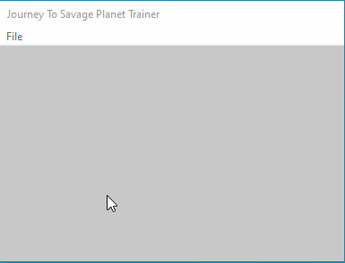

## Creating an input box

Now that we have our window we can make our input box so that we can start modifying our values. To do this, we want to use CreateWindow to create a [static control](https://docs.microsoft.com/en-us/windows/win32/controls/static-controls) and an [edit control](https://docs.microsoft.com/en-us/windows/win32/controls/edit-controls).

```c++
#define MAX_SPEED_INPUT		1

...

LRESULT CALLBACK DLLWindowProc(HWND hwnd, UINT message, WPARAM wParam, LPARAM lParam)
{

	switch (message)
	{
	case WM_CREATE:
		CreateWindow(TEXT("static"), TEXT("Max Speed: "),
			WS_VISIBLE | WS_CHILD | SS_CENTER,
			5, 5, 80, 20,
			hwnd, NULL, NULL, NULL);
		CreateWindow(TEXT("edit"), TEXT("1"),
			WS_VISIBLE | WS_CHILD | ES_CENTER,
			90, 5, 110, 20,
			hwnd, (HMENU)MAX_SPEED_INPUT, ((LPCREATESTRUCT)lParam)->hInstance, NULL);
		break;
	case WM_COMMAND:

		switch (wParam)
		{
		case MYMENU_EXIT:
			SendMessage(hwnd, WM_CLOSE, 0, 0);
			break;
		}
		break;
	case WM_DESTROY:
		PostQuitMessage(0);
		break;
	default:
		return DefWindowProc(hwnd, message, wParam, lParam);
	}
	return 0;
}
```

We create these messages when the message is `WM_CREATE`, aka, when the window is created. We add the style of the control, the flags, the size and location, and finally information such as the HMENU value. The HMENU value is important because since that is how we are going to reference the window throughout the program, because of this all HMENU values need to be unique. Since we don't need to access the label at runtime we can just leave it as NULL.

When we build and inject the program we can see the following:


## Accessing the input box

Now that we have our input box it is time to get the value and actually use it. We will start off by hooking the speed function so that we have a place to access the input value. Since this is something we went over earlier I am just going to post the code snippet for the function hook:

<details>
<summary>Current Code (click to expand)</summary>

```c++
// dllmain.cpp : Defines the entry point for the DLL application.
#include "pch.h"
#include "../CPPToolLib/CPP Tools/stdafx/stdafx.h"
#include "../CPPToolLib/CPP Tools/hook/hook.h"
#include "../CPPToolLib/CPP Tools/mem/mem.h"

// Function typedefs
typedef BOOL(__thiscall* tCanJump)(void*);
typedef float(__fastcall* tGetMaxSpeed)(void*);

// Function gateways
tCanJump canJumpGateway;
tGetMaxSpeed getMaxSpeedGateway;

// Constants
bool unlimited_shots = false, unlimited_jumps = false;

// UI
#define MYMENU_EXIT         (WM_APP + 101)
#define MYMENU_MESSAGEBOX   (WM_APP + 102) 

#define MAX_SPEED_INPUT		1

HINSTANCE hMod;
HWND hwnd;

//WndProc for the new window
LRESULT CALLBACK DLLWindowProc(HWND, UINT, WPARAM, LPARAM);

//Register our windows Class
BOOL RegisterDLLWindowClass(wchar_t szClassName[])
{
	WNDCLASSEX wc;
	wc.hInstance = hMod;
	wc.lpszClassName = (LPCWSTR)szClassName;
	wc.lpfnWndProc = DLLWindowProc;
	wc.style = CS_DBLCLKS;
	wc.cbSize = sizeof(WNDCLASSEX);
	wc.hIcon = LoadIcon(NULL, IDI_APPLICATION);
	wc.hIconSm = LoadIcon(NULL, IDI_APPLICATION);
	wc.hCursor = LoadCursor(NULL, IDC_ARROW);
	wc.lpszMenuName = NULL;
	wc.cbClsExtra = 0;
	wc.cbWndExtra = 0;
	wc.hbrBackground = (HBRUSH)COLOR_BACKGROUND;
	if (!RegisterClassEx(&wc))
		return 0;
}
//Creating our windows Menu
HMENU CreateDLLWindowMenu()
{
	HMENU hMenu;
	hMenu = CreateMenu();
	HMENU hMenuPopup;
	if (hMenu == NULL)
		return FALSE;
	hMenuPopup = CreatePopupMenu();
	AppendMenu(hMenuPopup, MF_STRING, MYMENU_EXIT, TEXT("Exit"));
	AppendMenu(hMenu, MF_POPUP, (UINT_PTR)hMenuPopup, TEXT("File"));

	return hMenu;
}

//Our new windows proc
LRESULT CALLBACK DLLWindowProc(HWND hwnd, UINT message, WPARAM wParam, LPARAM lParam)
{

	switch (message)
	{
	case WM_CREATE:
		CreateWindow(TEXT("static"), TEXT("Max Speed: "),
			WS_VISIBLE | WS_CHILD | SS_CENTER,
			5, 5, 80, 20,
			hwnd, NULL, NULL, NULL);
		CreateWindow(TEXT("edit"), TEXT("1"),
			WS_VISIBLE | WS_CHILD | ES_CENTER,
			90, 5, 110, 20,
			hwnd, (HMENU)MAX_SPEED_INPUT, ((LPCREATESTRUCT)lParam)->hInstance, NULL);
		break;
	case WM_COMMAND:

		switch (wParam)
		{
		case MYMENU_EXIT:
			SendMessage(hwnd, WM_CLOSE, 0, 0);
			break;
		}
		break;
	case WM_DESTROY:
		PostQuitMessage(0);
		break;
	default:
		return DefWindowProc(hwnd, message, wParam, lParam);
	}
	return 0;
}


// Hooked can jump function
BOOL __fastcall hCanJump(BYTE* _this, void* _ECX)
{

	if (unlimited_jumps)
		*(float*)(_this + 0x11F4) = 1.0;

	return canJumpGateway(_this);
}

// Hooked get max speed function
float __fastcall hGetMaxSpeed(BYTE* _this, void* _EDX)
{
	std::cout << "Max speed" << std::endl;
	return getMaxSpeedGateway(_this);
}

DWORD WINAPI MainThread(LPVOID param)
{
	// Allocate Console
	AllocConsole();
	FILE* f;
	freopen_s(&f, "CONOUT$", "w", stdout);

	// Get Module Info
	MODULEINFO mInfo;
	GetModuleInformation(GetCurrentProcess(), GetModuleHandle(L"Towers-Win64-Shipping.exe"), &mInfo, sizeof(MODULEINFO));

	// Create can jump hook
	Hook canJump((BYTE*)((uintptr_t)mInfo.lpBaseOfDll + 0x8778C0), (BYTE*)hCanJump, (BYTE*)&canJumpGateway, 15);

	// Create max speed hook
	Hook getMaxSpeed((BYTE*)((uintptr_t)mInfo.lpBaseOfDll + 0x7c29b0), (BYTE*)hGetMaxSpeed, (BYTE*)&getMaxSpeedGateway, 15);

	// Enable hooks
	canJump.Enable();
	getMaxSpeed.Enable();

	// Main Loop
	// Create window menu
	HMENU hMenu = CreateDLLWindowMenu();

	// Register window
	RegisterDLLWindowClass((wchar_t*)L"JourneyHack");

	// Create Window
	hwnd = CreateWindowEx(0, L"JourneyHack", L"Journey To Savage Planet Trainer", WS_EX_PALETTEWINDOW, CW_USEDEFAULT, CW_USEDEFAULT, 800, 600, NULL, hMenu, hMod, NULL);

	// Show window
	ShowWindow(hwnd, SW_SHOWNORMAL);

	// Loop and translate messages till end
	MSG messages;
	while (GetMessage(&messages, NULL, 0, 0))
	{
		TranslateMessage(&messages);
		DispatchMessage(&messages);
	}

	// Disable hooks
	getMaxSpeed.Disable();
	canJump.Disable();

	// Free console
	fclose(f);
	FreeConsole();

	// Free thread
	FreeLibraryAndExitThread((HMODULE)param, 0);
	return 0;
}

BOOL APIENTRY DllMain(HMODULE hModule,
	DWORD  ul_reason_for_call,
	LPVOID lpReserved
)
{
	switch (ul_reason_for_call)
	{
	case DLL_PROCESS_ATTACH:
		hMod = hModule;
		CreateThread(0, 0, MainThread, hModule, 0, 0);
	case DLL_THREAD_ATTACH:
	case DLL_THREAD_DETACH:
	case DLL_PROCESS_DETACH:
		break;
	}
	return TRUE;
}
```
</details>

Once built and injected we can confirm that the hook worked by checking the console to see if we get the output:

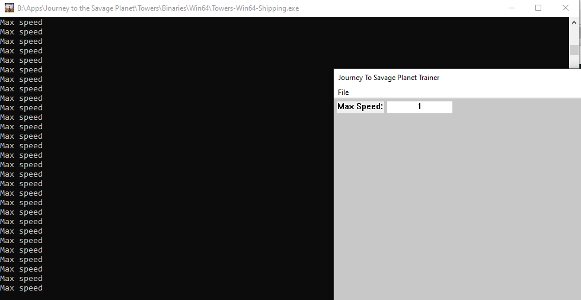

Now that we have the hook we can try accessing the value from the edit field. To do this we are going to write a parsing class:


```c++
class Parser
{
public:
	Parser() {};

	float tryParse(int fieldId, float default_value = 1.0f)
	{
		id = fieldId;

		__try
		{
			tryparse();
		}
		__except (EXCEPTION_EXECUTE_HANDLER)
		{
			value = default_value;
		}

		return value;
	}
private:
	float value;
	int id;

	void tryparse()
	{
		HWND max_len = GetDlgItem(hwnd, id);

		TCHAR buff[1024];

		GetWindowText(max_len, buff, GetWindowTextLength(max_len) + 1);

		std::wstring wide(buff);

		value = std::stof(wide);
	}
};
```

The parsing class has a single public function `tryParse` which takes in the id of whatever field we want to read as well as an optional value for the default value if the text field cannot be parsed properly. This function then calls the private function which attempts to get the value and then tries converting it to a float. The function then returns the float value. 

I then made a global pointer for the Parser and initialized it at the start of the thread, then I called it in the speed hook to see if we got the right value:

```c++
// Hooked get max speed function
float __fastcall hGetMaxSpeed(BYTE* _this, void* _EDX)
{
	std::cout << p->tryParse(MAX_SPEED_INPUT) << std::endl;
	return getMaxSpeedGateway(_this);
}
```

When we build and inject we can see how it works:

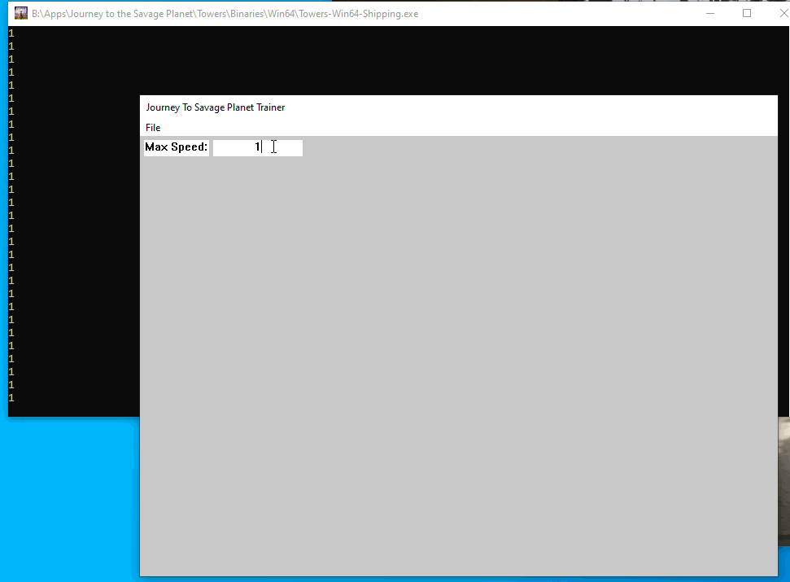

Now that we can enter a value through the GUI lets try using that value in our game. Luckily this is pretty simple since we only need to multiply the value from the gateway with the value we parse:

```c++
// Hooked get max speed function
float __fastcall hGetMaxSpeed(BYTE* _this, void* _EDX)
{
	return getMaxSpeedGateway(_this) * p->tryParse(MAX_SPEED_INPUT);
}
```

Now lets build and see what happens:


## Creating a checkbox

Now that we have a GUI with an input box for the speed, we need some way to toggle our other hacks. For this we are going to use a checkbox. Checkboxes are of type [button control](https://docs.microsoft.com/en-us/windows/win32/controls/buttons), if you want to know more about them you can read through the MSDN docs. Once again, we are going to create this control in `WM_CREATE`, so lets take a look at the code:

```c++
CreateWindow(TEXT("button"), TEXT("Enable Unlimited Jumps"),
	WS_VISIBLE | WS_CHILD | BS_AUTOCHECKBOX,
	5, 30, 195, 20,
	hwnd, (HMENU)UNLIMITED_JUMPS, ((LPCREATESTRUCT)lParam)->hInstance, NULL);
```

Here we create a new window of type button control, and in the styles we set `BS_AUTOCHECKBOX`. This is a type of checkbox where it automatically toggles when clicked, if you want that it can only be set under certain conditions you can just use `BS_CHECKBOX`.

We then want to check when the checkbox is clicked. We do this in `WM_COMMAND` where we have a switch statement in which we check the 2 lowest order bytes against the button HMENU number.

```c++
	case WM_COMMAND:

		switch (LOWORD(wParam))
		{
		case UNLIMITED_JUMPS:
			if (IsDlgButtonChecked(hwnd, UNLIMITED_JUMPS)) 
				unlimited_jumps = !unlimited_jumps;
			break;
		}

		switch (wParam)
		{
		case MYMENU_EXIT:
			SendMessage(hwnd, WM_CLOSE, 0, 0);
			break;
		}
		break;
```

Building and injecting this code we get the following GUI:

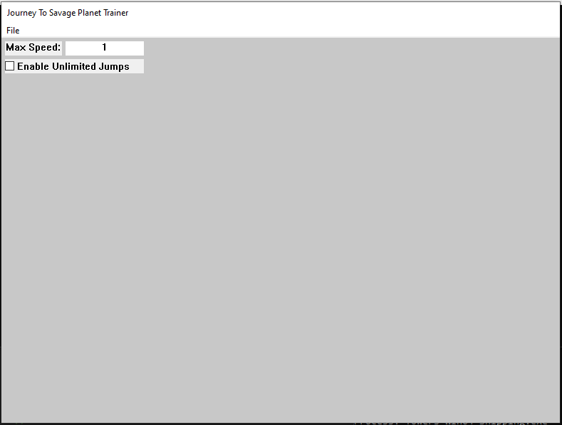

# Signature Scanning

The final step for any game hack is replacing the hard coded address offsets with signature scanning. This is because as games or applications are updated the offsets may change. This may not be the most important in some offline game that you plan to never update, but since most games get regular updates, having to find your offsets each time will end up being very annoying. Luckily CPPToolLib has functions to do this for us so we just need to focus on the general theory behind it.

Lets start with our `HasEnoughFuelToUseJetpackJumpJets` function by grabbing the opcodes for the function:

```
8778C0 48 8B 81 00 08 00 00                          mov     rax, [rcx+800h]
8778C7 F3 0F 10 80 AC 05 00 00                       movss   xmm0, dword ptr [rax+5ACh]
8778CF 0F 2F 81 F4 11 00 00                          comiss  xmm0, dword ptr [rcx+11F4h]
8778D6 0F 96 C0                                      setbe   al
8778D9 C3                                            retn
```

We need to create a bytecode signature so that if we search for a sequence of bytes we will find this function without finding any others. We also need to be sure that we do not include any opcodes that may change, such as offsets or values.

For our first instruction the opcodes we have are: `48 8B 81 00 08 00 00`. However, as you can see we have `rcx+800h` so the only bytes we should use for our signature are `48 8B 81` with wild cards for the other values since they could change. Cheat engine, as well as all of the main decompilers let you search for bytecode sequences so you can simply keep making your signature longer until you find one which only returns the code we want. For this function we end up with:

`48 8b 81 ?? ?? ?? ?? f3 0f 10 80 ?? ?? ?? ?? 0f 2f 81 ?? ?? ?? ?? 0f 96 c0 c3`

Where ?? is a wildcard. Since this was a very small function we had to use the entire thing, this is not normally the case. 

Now that we have a bytecode signature we can use the library and replace the original hook creation:

```c++
Hook canJump((BYTE*)((uintptr_t)mInfo.lpBaseOfDll + 0x8778C0), (BYTE*)hCanJump, (BYTE*)&canJumpGateway, 15);
```

With the signature scanning code:

```c++
Hook canJump((BYTE*)sigscan::PatternScanInternal((char*)mInfo.lpBaseOfDll, mInfo.SizeOfImage, (char*)"\x48\x8b\x81\x00\x00\x00\x00\xf3\x0f\x10\x80\x00\x00\x00\x00\x0f\x2f\x81\x00\x00\x00\x00\x0f\x96\xc0\xc3", (char*)"xxx????xxxx????xxx????xxxx"), (BYTE*)hCanJump, (BYTE*)&canJumpGateway, 15);
```

We also need to remember to add the import to the function scanning code with:

```c++
#include "../CPPToolLib/CPP Tools/sigscan/sigscan.h"
```

With this new code, our unlimited jumps hack will most likely continue working when the game is updated unless there was a massive overhaul of the code or the specific function.

# Conclusion

I hope you enjoyed this quick intro into hacking windows applications using a video game, if you have any questions feel free to reach out to me on twitter or via email (on my github profile). 

I encourage you to try to expand the hack to include different things such as increasing the speed of enemies, stopping loss of health or stamina, or other fun things you could find. Below I have added the finished code that you should have by the end of the post if you updated all aspects. This code includes a GUI with an unlimited jumps hack, a speed multiplier hack, and an unlimited ammo hack.

<details>
<summary>Finalized code</summary>

```c++
// dllmain.cpp : Defines the entry point for the DLL application.
#include "pch.h"
#include "../CPPToolLib/CPP Tools/stdafx/stdafx.h"
#include "../CPPToolLib/CPP Tools/hook/hook.h"
#include "../CPPToolLib/CPP Tools/sigscan/sigscan.h"
#include "../CPPToolLib/CPP Tools/mem/mem.h"

// Function typedefs
typedef BOOL(__thiscall* tCanJump)(void*);
typedef float(__fastcall* tGetMaxSpeed)(void*);

// Function gateways
tCanJump canJumpGateway;
tGetMaxSpeed getMaxSpeedGateway;

// Constants
bool unlimited_shots = false, unlimited_jumps = false;

// Addresses
uintptr_t unlimited_shots_addy;

// UI
#define MYMENU_EXIT         (WM_APP + 101)
#define MYMENU_MESSAGEBOX   (WM_APP + 102) 

#define MAX_SPEED_INPUT		1
#define UNLIMITED_JUMPS		2
#define UNLIMITED_SHOTS		3

HINSTANCE hMod;
HWND hwnd;
MODULEINFO mInfo;

// Parser class
class Parser
{
public:
	Parser() {};

	float tryParse(int fieldId, float default_value = 1.0f)
	{
		id = fieldId;

		__try
		{
			tryparse();
		}
		__except (EXCEPTION_EXECUTE_HANDLER)
		{
			value = default_value;
		}

		return value;
	}
private:
	float value;
	int id;

	void tryparse()
	{
		HWND max_len = GetDlgItem(hwnd, id);

		TCHAR buff[1024];

		GetWindowText(max_len, buff, GetWindowTextLength(max_len) + 1);

		std::wstring wide(buff);

		value = std::stof(wide);
	}
};

Parser* p;

//WndProc for the new window
LRESULT CALLBACK DLLWindowProc(HWND, UINT, WPARAM, LPARAM);

//Register our windows Class
BOOL RegisterDLLWindowClass(wchar_t szClassName[])
{
	WNDCLASSEX wc;
	wc.hInstance = hMod;
	wc.lpszClassName = (LPCWSTR)szClassName;
	wc.lpfnWndProc = DLLWindowProc;
	wc.style = CS_DBLCLKS;
	wc.cbSize = sizeof(WNDCLASSEX);
	wc.hIcon = LoadIcon(NULL, IDI_APPLICATION);
	wc.hIconSm = LoadIcon(NULL, IDI_APPLICATION);
	wc.hCursor = LoadCursor(NULL, IDC_ARROW);
	wc.lpszMenuName = NULL;
	wc.cbClsExtra = 0;
	wc.cbWndExtra = 0;
	wc.hbrBackground = (HBRUSH)COLOR_BACKGROUND;
	if (!RegisterClassEx(&wc))
		return 0;
}
//Creating our windows Menu
HMENU CreateDLLWindowMenu()
{
	HMENU hMenu;
	hMenu = CreateMenu();
	HMENU hMenuPopup;
	if (hMenu == NULL)
		return FALSE;
	hMenuPopup = CreatePopupMenu();
	AppendMenu(hMenuPopup, MF_STRING, MYMENU_EXIT, TEXT("Exit"));
	AppendMenu(hMenu, MF_POPUP, (UINT_PTR)hMenuPopup, TEXT("File"));

	return hMenu;
}

//Our new windows proc
LRESULT CALLBACK DLLWindowProc(HWND hwnd, UINT message, WPARAM wParam, LPARAM lParam)
{

	switch (message)
	{
	case WM_CREATE:
		CreateWindow(TEXT("static"), TEXT("Max Speed: "),
			WS_VISIBLE | WS_CHILD | SS_CENTER,
			5, 5, 80, 20,
			hwnd, NULL, NULL, NULL);
		CreateWindow(TEXT("edit"), TEXT("1"),
			WS_VISIBLE | WS_CHILD | ES_CENTER,
			90, 5, 110, 20,
			hwnd, (HMENU)MAX_SPEED_INPUT, ((LPCREATESTRUCT)lParam)->hInstance, NULL);
		CreateWindow(TEXT("button"), TEXT("Enable Unlimited Jumps"),
			WS_VISIBLE | WS_CHILD | BS_AUTOCHECKBOX,
			5, 30, 195, 20,
			hwnd, (HMENU)UNLIMITED_JUMPS, ((LPCREATESTRUCT)lParam)->hInstance, NULL);
		CreateWindow(TEXT("button"), TEXT("Enable Unlimited Shots"),
			WS_VISIBLE | WS_CHILD | BS_AUTOCHECKBOX,
			5, 55, 195, 20,
			hwnd, (HMENU)UNLIMITED_SHOTS, ((LPCREATESTRUCT)lParam)->hInstance, NULL);
		break;
	case WM_COMMAND:

		switch (LOWORD(wParam))
		{
		case UNLIMITED_JUMPS:
			if (IsDlgButtonChecked(hwnd, UNLIMITED_JUMPS)) 
				unlimited_jumps = !unlimited_jumps;
			break;
		case UNLIMITED_SHOTS:
			if (IsDlgButtonChecked(hwnd, UNLIMITED_SHOTS))
				mem::Nop((BYTE*)unlimited_shots_addy, 8);
			else
				mem::Patch((BYTE*)unlimited_shots_addy, (BYTE*)"\xF3\x0F\x11\x83\x8C\x01\x00\x00", 8);
			unlimited_shots = !unlimited_shots;
			break;
		}

		switch (wParam)
		{
		case MYMENU_EXIT:
			SendMessage(hwnd, WM_CLOSE, 0, 0);
			break;
		}
		break;
	case WM_DESTROY:
		PostQuitMessage(0);
		break;
	default:
		return DefWindowProc(hwnd, message, wParam, lParam);
	}
	return 0;
}

// Hooked can jump function
BOOL __fastcall hCanJump(BYTE* _this, void* _ECX)
{

	if (unlimited_jumps)
		*(float*)(_this + 0x11F4) = 1.0;

	return canJumpGateway(_this);
}

// Hooked get max speed function
float __fastcall hGetMaxSpeed(BYTE* _this, void* _EDX)
{
	return getMaxSpeedGateway(_this) * p->tryParse(MAX_SPEED_INPUT);
}

DWORD WINAPI MainThread(LPVOID param)
{

	// Initialize parser
	p = new Parser();

	// Get Module Info
	GetModuleInformation(GetCurrentProcess(), GetModuleHandle(L"Towers-Win64-Shipping.exe"), &mInfo, sizeof(MODULEINFO));

	// Create can jump hook
	Hook canJump((BYTE*)sigscan::PatternScanInternal((char*)mInfo.lpBaseOfDll, mInfo.SizeOfImage, (char*)"\x48\x8b\x81\x00\x00\x00\x00\xf3\x0f\x10\x80\x00\x00\x00\x00\x0f\x2f\x81\x00\x00\x00\x00\x0f\x96\xc0\xc3", (char*)"xxx????xxxx????xxx????xxxx"), (BYTE*)hCanJump, (BYTE*)&canJumpGateway, 15);

	// Create max speed hook
	Hook getMaxSpeed((BYTE*)sigscan::PatternScanInternal((char*)mInfo.lpBaseOfDll, mInfo.SizeOfImage, (char*)"\x48\x89\x5c\x24\x10\x57\x48\x83\xec\x00\x0f\x29\x74\x24\x20\x48\x8b\xf9", (char*)"xxxxxxxxx?xxxxxxxx"), (BYTE*)hGetMaxSpeed, (BYTE*)&getMaxSpeedGateway, 15);

	// Get address of unlimited shots patch
	unlimited_shots_addy = (uintptr_t)sigscan::PatternScanInternal((char*)mInfo.lpBaseOfDll, mInfo.SizeOfImage, (char*)"\xf3\x0f\x11\x83\x00\x00\x00\x00\xe8\xaa\x5c\x01\x00", (char*)"xxxx????xxxxx");

	// Enable hooks
	canJump.Enable();
	getMaxSpeed.Enable();

	// Main Loop
	// Create window menu
	HMENU hMenu = CreateDLLWindowMenu();

	// Register window
	RegisterDLLWindowClass((wchar_t*)L"JourneyHack");

	// Create Window
	hwnd = CreateWindowEx(0, L"JourneyHack", L"Journey To Savage Planet Trainer", WS_EX_PALETTEWINDOW, CW_USEDEFAULT, CW_USEDEFAULT, 800, 600, NULL, hMenu, hMod, NULL);

	// Show window
	ShowWindow(hwnd, SW_SHOWNORMAL);

	// Loop and translate messages till end
	MSG messages;
	while (GetMessage(&messages, NULL, 0, 0))
	{
		TranslateMessage(&messages);
		DispatchMessage(&messages);
	}

	// Disable hooks
	getMaxSpeed.Disable();
	canJump.Disable();

	// Remove patch if its still there
	if (unlimited_shots)
		mem::Patch((BYTE*)unlimited_shots_addy, (BYTE*)"\xF3\x0F\x11\x83\x8C\x01\x00\x00", 8);

	// Free parser
	free(p);

	// Free thread
	FreeLibraryAndExitThread((HMODULE)param, 0);
	return 0;
}

BOOL APIENTRY DllMain(HMODULE hModule,
	DWORD  ul_reason_for_call,
	LPVOID lpReserved
)
{
	switch (ul_reason_for_call)
	{
	case DLL_PROCESS_ATTACH:
		hMod = hModule;
		CreateThread(0, 0, MainThread, hModule, 0, 0);
	case DLL_THREAD_ATTACH:
	case DLL_THREAD_DETACH:
	case DLL_PROCESS_DETACH:
		break;
	}
	return TRUE;
}
```

</details>